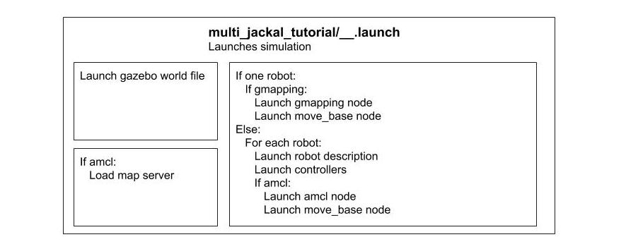
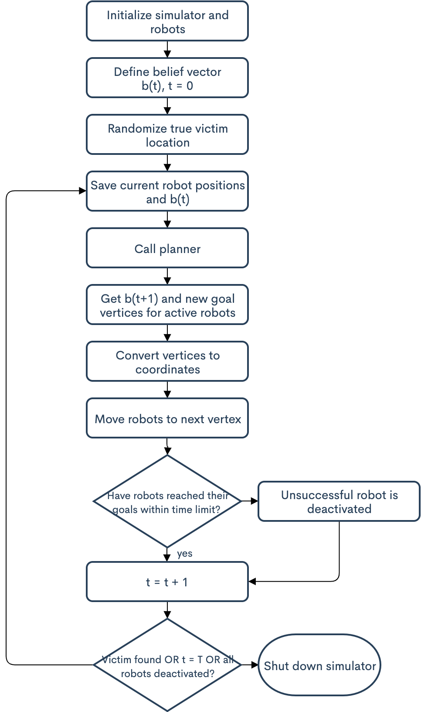

# Search and Rescue Simulator

[**Overview**](#overview) | [**Prerequisites**](#prerequisites) | [**Installing**](#installing) | [**Running**](#running-the-simulation) 
| [**Data**](#simulation-data) | [**Repo Content**](#repository-content) | [**Schematic**](#launch-file-schematic) | [**Authors**](#authors)


## Overview
Our goal for this project was to design a simulator on Gazebo for search-and-rescue missions. We want to be able to test different robots and path planning algorithms in a realistic disaster scenario. For this project, we are using Gazebo 7 with ROS-Kinetic and the Jackal Robot. The first scenario chosen is the School Scenario (SS-1). <br />

You are welcome to use our material. If you do so, please cite our [paper](https://ieeexplore.ieee.org/abstract/document/9366368?casa_token=hrXCiSLKUMYAAAAA:djMlZYwuKUHiNHB5i-aWCQWZy98jSx7v5Tc1DCwKmlK5FFEwfsQI1TVH1OQ3UsLVYBVFbpwaJA):

```
@article{shree2021exploiting,
  title={Exploiting Natural Language for Efficient Risk-Aware Multi-Robot SaR Planning},
  author={Shree, Vikram and Asfora, Beatriz and Zheng, Rachel and Hong, Samantha and Banfi, Jacopo and Campbell, Mark},
  journal={IEEE Robotics and Automation Letters},
  volume={6},
  number={2},
  pages={3152--3159},
  year={2021},
  publisher={IEEE}
}
```
Autonomous Systems [Lab page](http://cornell-asl.org/) | [project page](https://confluence.cornell.edu/display/asl/Search+and+Rescue+Simulator)


### Prerequisites

You will need the jackal packages and ROS navigation stack.
```
sudo apt-get install ros-kinetic-jackal-simulator ros-kinetic-jackal-desktop ros-kinetic-jackal-navigation
sudo apt install ros-kinetic-timed-roslaunch
```

### Installing

Clone the repository in a workspace.
```
git clone https://github.coecis.cornell.edu/sh974/SearchandRescue.git
```

Copy the hector_quadrotor_sim, multi_robot, quadrotor_navigation, and simple_navigation_goals packages into your catkin workspace. 
```
cp -r hector_quadrotor_sim multi_robot quadrotor_navigation simple_navigation_goals ~/catkin_ws/src
```
or you can manually copy and paste the necessary packages into your local catkin workspace. 

Don't forget to:
```
cd ~/catkin_ws/
catkin_make
source ~/catkin_ws/devel/setup.bash
```

To use the planner, 
```
cd ~/catkin_ws/src/simple_navigation_goals/src/planner
git clone https://github.com/basfora/milp_sim.git
```
Follow the instructions on https://github.com/basfora/milp_sim. 

## Running the Simulation
### School World with Two Jackals and Hector Quadrotor
Launch world, spawn robots, launch navigation nodes
```
roslaunch multi_jackal_tutorials jackal_drone.launch folder:=<absolute folder path for output> belief:=<belief vector number> 
```

### School World with Two Jackals
Launch world, spawn robots, launch navigation nodes
```
roslaunch multi_jackal_tutorials two_jackal.launch gui:=true
```
Send multiple waypoints to robots
```
roslaunch simple_navigation_goals move_base_seq.launch ns:=jackal0
```
### Gmapping World with One Jackal
Change parameter: jackal0/front_laser -> front_laser
```
cd multi_robot/multi_jackal_nav/params
gedit costmap_common_params.yaml
cd multi_robot/multi_jackal_nav/params/odom_nav_params
gedit global_costmap_params.yaml
```
Launch gmapping with a single robot
```
roslaunch multi_jackal_tutorials one_jackal.launch gui:=true
```
Send multiple waypoints to robots (all points will be relative to robot spawn position, aka the map origin)
```
roslaunch simple_navigation_goals move_base_seq.launch ns:=/
```
Save map, creates a .pgm and .yaml file
```
rosrun map_server map_saver -f <my_map_name>
```
## Simulation Data
To generate plots from the simulator data: 
```
cd data
./generatePlots.bash 
```
This will save the plots to the data/plots directory. 

## Repository Content
### data - output pickle files and plots
Contains pickle file data that we collected and scripts to generate meaningful plots. 
### multi_robot - multiple robot simulations
Contains all files that launch the robot simulations. Simulation launch files are located in multi_jackal_tutorials, navigation launch and parameter files are in multi_jackal_nav. Based off [multi_jackal](https://github.com/NicksSimulationsROS/multi_jackal).
### simple_navigation_goals - waypoints
Contains all files that send waypoints/navigation goals to the robots. This folder also holds the main control script (move_base_3_robots.py) and the planner. 
### quadrotor_navigation - drone navigation
Contains all files that launch the quadrotor robot navigation. Is used by multi_robot, and depends on hector_quadrotor_sim.
### hector_quadrotor_sim - drone files
Contains all files that configure quadrotor robot, including description files, controller setup, plugins, etc. Cloned from [here](https://bitbucket.org/theconstructcore/hector_quadrotor_sim/src/master/).
### environment - floor plan and models
Contains furnished and unfurnished .world files of the school environment

## Launch File Schematic
### Simulation Framework
<p align="center">
	
</p>

## Main Program Flow Chart
### Waypoint Sending Node Framework
<p align="center">
	
</p>


## Simulation Errors
There may be an issue with launching Gazebo or RVIZ when trying to use the simulator. If that is the case, CTRL + C to shut down the simulator, source the setup.bash script in your local catkin_ws/devel directory, and then relaunch the simulator. An example of this taken on video is in the img folder of this repository. 


## Built With

* [Jackal UGV](https://www.clearpathrobotics.com/assets/guides/kinetic/jackal/simulation.html)
* [Hector UAV](https://github.com/tu-darmstadt-ros-pkg/hector_quadrotor)
* [ROS Navigation Stack](http://wiki.ros.org/navigation)


## Authors

* **Sam Hong** - *sh974*

* **Rachel Zheng** - *rz246*

## Acknowledgments

* **Beatriz Asfora** - *ba386*
* **Jacopo Banfi** - *jb2639*
* **Professor Mark Campbell**

